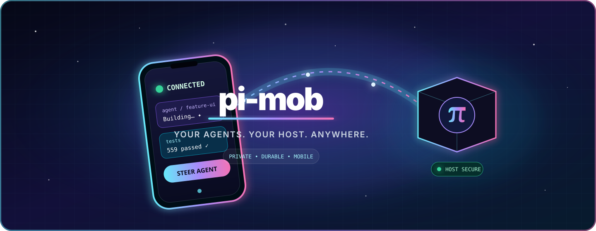

<p align="center">
  
</p>

# pi-mob

**Run and supervise [Pi](https://github.com/earendil-works/pi) coding-agent sessions from your phone—without moving repositories, API keys, or durable session state off your Mac.**

pi-mob is a private mobile control surface, not a remote terminal. The Flutter app connects through your tailnet to a loopback-only bridge on a host you control. From your phone you can create sessions, watch work unfold, steer agents, respond to attention items, queue follow-ups, and stop work safely.

> [!WARNING]
> **Preview software.** Android and the macOS bridge are available for testing, but neither is production-signed. The bridge is currently macOS x86_64-only, and iOS is not yet distributed.

## Get started

### 1. Prepare your private network

Install [Tailscale](https://tailscale.com/download) on your Android phone and Mac, sign both into the same tailnet, and make sure Pi works on the Mac. pi-mob never installs Tailscale or runs `tailscale up` for you.

### 2. Install the Android app

Download the latest `pi-mob-android-preview-*.apk` and adjacent `.sha256` file from [GitHub Releases](https://github.com/followdeKlerk/pi-mob/releases). Verify the checksum before sideloading:

```sh
shasum -a 256 -c pi-mob-android-preview-*.apk.sha256
```

See the [mobile installation guide](apps/mobile/README.md) for Android requirements, signing warnings, and pairing help.

### 3. Set up the bridge on your Mac

Download the matching macOS bridge archive and checksum from [GitHub Releases](https://github.com/followdeKlerk/pi-mob/releases), then:

```sh
shasum -a 256 -c pi-mob-bridge-*-macos-x64.tar.gz.sha256
tar -xzf pi-mob-bridge-*-macos-x64.tar.gz
./release/bin/pi-mob setup --workspace /absolute/path/to/your/repository
```

Setup checks Pi and Tailscale, copies the required executables into `~/.pi-mob`, installs the user LaunchAgent, configures the bridge-owned private Tailscale Serve route, and starts the bridge. It guides you if Tailscale is missing, signed out, or missing MagicDNS; it does not silently provision anything.

After setup, use the installed CLI from anywhere:

```sh
~/.pi-mob/release/bin/pi-mob status
~/.pi-mob/release/bin/pi-mob stop
~/.pi-mob/release/bin/pi-mob start
```

See the [host bridge guide](packages/bridge/README.md) for prerequisites, verification, troubleshooting, and advanced operations.

### 4. Pair your phone

Successful interactive setup displays a scannable QR made from the bridge's durable host identity. Scan it in the app and verify the host details before confirming. If scanning is inconvenient, enter the displayed `https://…ts.net` address manually; the app validates and saves a successful connection for reuse.

## What you can do

- Create, observe, steer, queue, and stop Pi sessions from a mobile-first interface.
- Reconnect without losing the durable command and event history owned by the host.
- See uncertain work as **indeterminate** instead of risking a silent duplicate execution.
- Work across trusted repositories with host-enforced full or read-only policy.
- Review attention items, agent activity, bounded attachments, exports, and status notifications.
- Change bridge addresses later without discarding local prompt drafts.

## Where everything lives

| Component | Runs on | Owns |
| --- | --- | --- |
| **Mobile app** | Android phone | Presentation, local connection metadata, and user controls |
| **Bridge** | Your Mac | Private HTTPS/WebSocket endpoint, durable delivery, policy, and process supervision |
| **Pi** | Your Mac | Agent reasoning, tools, sessions, and workspace interaction |
| **Tailscale** | Both devices | Private network reachability; Funnel and public listeners are not used |

```text
Android app ── private Tailscale HTTPS/WebSocket ──▶ loopback Bun bridge ──▶ Pi RPC ──▶ workspace
```

The Mac remains authoritative for repositories, provider credentials, Pi processes, and durable session state. The phone is a reconnectable control surface—never the place your source tree or API keys need to live.

## Availability

| Platform | Preview status |
| --- | --- |
| Android 10 / API 29+ | APK available through GitHub Releases |
| macOS 13+ x86_64 host | Unsigned bridge archive available through GitHub Releases |
| Apple Silicon host | Not yet validated for release |
| iOS | No App Store, TestFlight, or downloadable build yet |

## Development

Development requires Bun 1.3.14 and the Flutter toolchain used by CI.

```sh
bun install
bun run typecheck
bun test
cd apps/mobile && flutter analyze --no-fatal-infos && flutter test
```

## Documentation

- [Mobile app installation and pairing](apps/mobile/README.md)
- [Host bridge installation and operations](packages/bridge/README.md)
- [Architecture](docs/ARCHITECTURE.md)
- [Protocol](docs/PROTOCOL.md)
- [Privacy](docs/PRIVACY.md)
- [Security policy](SECURITY.md)
- [Contributing](CONTRIBUTING.md)

## License

[MIT](LICENSE)
